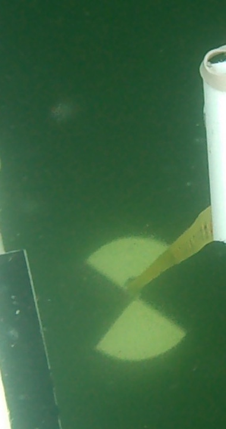

# Running the code

## Installation

First install the code with

```bash
git clone https://github.com/cloudmesh-community/fa18-423-08.git
cd fa18-423-08/project-code
```
### Install Anaconda

### Install CV2

On OSX

```bash
brew brew tap homebrew/science
```
### Install Progressbar
```bash
pip install progressbar
```

### Install tensorflow
```bash
pip install tensorflow
```

or

```conda
conda install -c conda-forge tensorflow
```

### Install Keras
```bash
pip install keras
```

or

```conda
conda install -c conda-forge keras
```

### Install pytesseract

```bash
pip install pytesseract
```
and

```bash
brew install tesseract
```


## Fetching the data

The Secchi Disk Data is located at 

https://drive.google.com/drive/folders/1W0EwjAcmZKgC-qEUosWNuUNwP4lOZ8fr

We have chose from that data the following video

https://drive.google.com/drive/folders/1KwldcJzSA-96bthUlFQD2yk8iOorBLDo

Please download it with the usual download button or use gdrive

Thei file is called. [DSCN0003.avi](https://drive.google.com/drive/folders/1KwldcJzSA-96bthUlFQD2yk8iOorBLDo) 

## Execution of the code


To run the program please do the following

Make sure secchi_full_process1212.py, secchi_classfication.h5, and the video file under the same directory.

Run the program at the command line with

```bash
python secchi_full_process1212.py DSCN0003.avi
```

where the file takes one argument for the video name


```python
import sys
import cv2
import pytesseract
from keras.models import load_model

def frame_catch(video_path, model):

    cap = cv2.VideoCapture(video_path)
    if not cap.isOpened():
        print("%s cannot be opened" % video_path)

    length =  int(cap.get(cv2.CAP_PROP_FRAME_COUNT))

    flag = False
    for count in range(length):
        print("Frame %i processing..." % count)
        cap.set(cv2.CAP_PROP_POS_FRAMES, count)
        capture, image = cap.read()
        if capture == True:
            image_mini = image[:,290:690,:] # 720*400
            image_mini = cv2.cvtColor(image_mini, cv2.COLOR_BGR2GRAY)
            image_mini = cv2.resize(image_mini,(90,50),interpolation=cv2.INTER_CUBIC)
            data = image_mini.reshape(1,90,50,1)
            softmax_output = model.predict(data)
            y_predict = (-softmax_output).argsort(axis=1)[:,0][0]
            if y_predict == 0:
                flag = True
                break
        else:
            continue
    cap.release()

    if flag == True:
        return image, 'Succeed'
    else:
        return image, 'Failed'


def depth_reco(image):

    print("Measurement processing...")
    x0, x1, y0, y1 = 1280, 640, 180, 400
    delta_x = -5

    flag = False
    for x in range(x0, x1, delta_x):
        mini_img = image[y0:y1, x:(x+160), :]
        count = 0
        for i in range(mini_img.shape[0]):
            for j in range(mini_img.shape[1]):
                b = mini_img[i,j,0]
                g = mini_img[i,j,1]
                r = mini_img[i,j,2]
                if b> 240 and g > 240 and r >240:
                    count = count + 1
        if count/(160*220) > 0.2:
            flag = True
            axis = x
            break

    if flag == True:
        mini_secchi = image_catch[y0:y1,axis:(axis+160),:]
        measurement = pytesseract.image_to_string(mini_secchi)

        return measurement, mini_secchi, 'Succeed'
    else:
        return measurement, mini_secchi, 'Failed'

if __name__== "__main__":

    video_path = sys.argv[1]
    model = load_model('secchi_classification.h5')
    image_catch, stat = frame_catch(video_path, model)
    cv2.imwrite("image_catch.jpg",image_catch)
    if stat == 'Failed':
        print("Something bad happened.")
    else:
        measurement, mea_pic, stat2 = depth_reco(image_catch)
        if stat2 == 'Failed':
            print("Recognition failed")
        else:
            cv2.imwrite('mea_pic.jpg', mea_pic)
            print(measurement)
```


## Training model steps

1. Seperate video into frames

2. Extract secchi segment from the frames


### 1. Seperate video into frames

Define a function to seperate the video into frames. There will be a main directory called "capture".

Inside capture, each video will have a folder to store the frames in.

This code is stored under:

https://github.com/cloudmesh-community/fa18-423-08/blob/master/project-code/secchi_videoprocessing.py

It should run in the command line in the format of:

```bash
python secchi_videoprocessing.py video 2
```

where the file takes two arguments, first one is the path of the videos, second one takes the number of cores to utilize

```python
import os  
import sys
import cv2
import threading
from progressbar import ProgressBar, Percentage, Bar

def MainRange(start, stop):
    for i in range(start, stop):
        try:
            folder = 'capture/' + videoname_list[i]
            
            cap = cv2.VideoCapture(video_list[i])
            if cap.isOpened():
                if not os.path.exists(folder):
                    os.makedirs(folder)
            else:
                print("%s cannot be opened" % videoname_list[i])
                continue
                
            length =  int(cap.get(cv2.CAP_PROP_FRAME_COUNT)) 
            width =  int(cap.get(cv2.CAP_PROP_FRAME_WIDTH))
            height =  int(cap.get(cv2.CAP_PROP_FRAME_HEIGHT))
            fps =  int(cap.get(cv2.CAP_PROP_FPS))        
            print (videoname_list[i], length, width, height, fps)
            
            pbar = ProgressBar(widgets=[Percentage(), Bar()], maxval=length+1).start()
            
            for count in range(length):
                cap.set(cv2.CAP_PROP_POS_FRAMES, count)
                capture, image = cap.read()
                if capture == True:
                    path = folder + '/frame{count:04}.jpg'.format(count=count)
                    cv2.imwrite(path, image)
                    pbar.update(count)
                else:
                    continue
            cap.release()                
        
        except:
            continue

#main section
if __name__== "__main__":
    videos_path = sys.argv[1] 
    threads_num = int(sys.argv[2])
    
    video_list = []
    videoname_list = []
    for root, dirs, files in os.walk(videos_path):
        for file in files:
            video_list.append(os.path.join(root, file))
            videoname_list.append(os.path.splitext(file)[0])
    
    if threads_num > len(video_list):
        threads_num = len(video_list)

    cut = round(len(video_list)/threads_num)
    threads = []
    for j in range(threads_num-1):
        threads.append(threading.Thread(target=MainRange,args=(j*cut,(j+1)*cut)))        
    threads.append(threading.Thread(target=MainRange,args=((threads_num-1)*cut,len(video_list))))
     
    for t in threads:
        t.setDaemon(True)
        t.start()
    t.join()
    print("Done!")
```

An example frame would look like this:


Second step is to extract the secchi disk from the frames.

The secchi disk is taken out of the frame by the pixel position of 290 < x < 690

The secchi disk segment image is then put into grayscale

Last, the secchi disk segment image is resized to  90*50.

The code is stored under:

https://github.com/cloudmesh-community/fa18-423-08/blob/master/project-code/secchi_segment.py

The command line:
```bash
python secchi_segment.py capture
```
where it takes one argument, the folder where the frames are stored.

```python
import os  
import sys
import cv2
from progressbar import ProgressBar, Percentage, Bar

def secchi_segment(frame):
    img = cv2.imread(frame)
    video_name = frame.split('\\')[1]
    frame_number = frame.split('\\')[2].split('.')[0]
    if not os.path.exists(video_name):
        os.makedirs(video_name)
    secchi = img[:,290:690,:]
    secchi = cv2.cvtColor(secchi, cv2.COLOR_BGR2GRAY)
    secchi = cv2.resize(secchi,(90,50),interpolation = cv2.INTER_CUBIC)
    path = video_name + '/frame_secchi_{number}.jpg'.format(number = frame_number)
    cv2.imwrite(path,secchi)
#main
if __name__== "__main__":
    frame_path = sys.argv[1]

    frame_list = []
    for root, dirs, files in os.walk(frame_path):
        for file in files:
            frame_list.append(os.path.join(root,file))
    for frame in frame_list:
        data = secchi_segment(frame)
        print(frame)
```

An example would look like:


