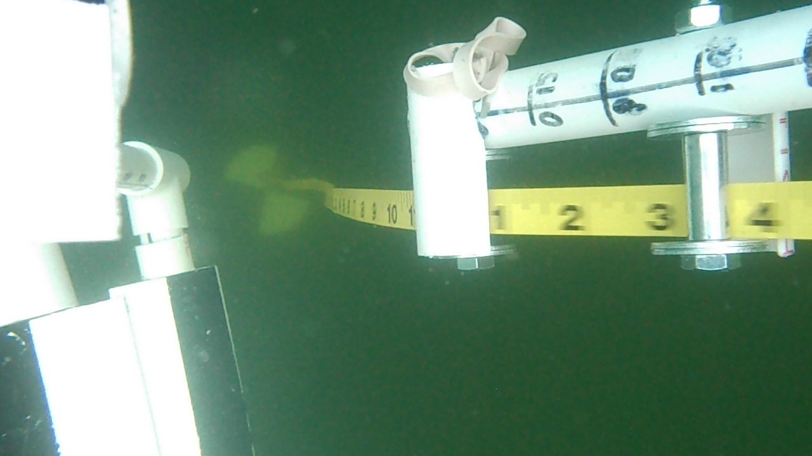

# Running the code

## Instalation

First install teh code with

```bash
git clone https://github.com/cloudmesh-community/fa18-423-08.git
cd fa18-423-08/project-code
```

### Install CV2

On OSX

```bash
brew brew tap homebrew/science
```
### Install Progressbar
```bash
pip install progressbar
```

## Fetching the data

The Secchi Disk Data is located at 

https://drive.google.com/drive/folders/1W0EwjAcmZKgC-qEUosWNuUNwP4lOZ8fr

We have chose from that data the following video

https://drive.google.com/drive/folders/1KwldcJzSA-96bthUlFQD2yk8iOorBLDo

Please download it with the usual download button or use gdrive

Thei file is called. [DSCN0003.avi](https://drive.google.com/drive/folders/1KwldcJzSA-96bthUlFQD2yk8iOorBLDo) 

## Execution of the code


To run the program please do the following

First import the necessary libraries

```python
import os  
import sys
import cv2
import threading
from progressbar import ProgressBar, Percentage, Bar
```

Define a function to seperate the video into frames. There will be a main directory called "capture".

Inside capture, each video will have a folder to store the frames in.

This code is stored under:

https://github.com/cloudmesh-community/fa18-423-08/blob/master/project-code/secchi_videoprocessing.py

It should run in the command line in the format of:

```bash
python secchi_videoprocessing.py video 2
```

where the file takes two arguments, first one is the path of the videos, second one takes the number of cores to utilize

```python
def MainRange(start, stop):
    for i in range(start, stop):
        try:
            folder = 'capture/' + videoname_list[i]
            
            cap = cv2.VideoCapture(video_list[i])
            if cap.isOpened():
                if not os.path.exists(folder):
                    os.makedirs(folder)
            else:
                print("%s cannot be opened" % videoname_list[i])
                continue
                
            length =  int(cap.get(cv2.CAP_PROP_FRAME_COUNT)) 
            width =  int(cap.get(cv2.CAP_PROP_FRAME_WIDTH))
            height =  int(cap.get(cv2.CAP_PROP_FRAME_HEIGHT))
            fps =  int(cap.get(cv2.CAP_PROP_FPS))        
            print (videoname_list[i], length, width, height, fps)
            
            pbar = ProgressBar(widgets=[Percentage(), Bar()], maxval=length+1).start()
            
            for count in range(length):
                cap.set(cv2.CAP_PROP_POS_FRAMES, count)
                capture, image = cap.read()
                if capture == True:
                    path = folder + '/frame{count:04}.jpg'.format(count=count)
                    cv2.imwrite(path, image)
                    pbar.update(count)
                else:
                    continue
            cap.release()                
        
        except:
            continue

#main section
if __name__== "__main__":
    videos_path = sys.argv[1] 
    threads_num = int(sys.argv[2])
    
    video_list = []
    videoname_list = []
    for root, dirs, files in os.walk(videos_path):
        for file in files:
            video_list.append(os.path.join(root, file))
            videoname_list.append(os.path.splitext(file)[0])
    
    if threads_num > len(video_list):
        threads_num = len(video_list)

    cut = round(len(video_list)/threads_num)
    threads = []
    for j in range(threads_num-1):
        threads.append(threading.Thread(target=MainRange,args=(j*cut,(j+1)*cut)))        
    threads.append(threading.Thread(target=MainRange,args=((threads_num-1)*cut,len(video_list))))
     
    for t in threads:
        t.setDaemon(True)
        t.start()
    t.join()
    print("Done!")
```

An example frame would look like this:




Second step is to extract the secchi disk from the frames.

The code is stored under:

https://github.com/cloudmesh-community/fa18-423-08/blob/master/project-code/secchi_segment.py

The command line:
```bash
python secchi_segment.py capture
```
where it takes one argument, the folder where the frames are stored.

```python
import os  
import sys
import cv2
from progressbar import ProgressBar, Percentage, Bar

def secchi_segment(frame):
    img = cv2.imread(frame)
    video_name = frame.split('\\')[1]
    frame_number = frame.split('\\')[2].split('.')[0]
    if not os.path.exists(video_name):
        os.makedirs(video_name)
    secchi = img[:,300:680,:]
    path = video_name + '/frame_secchi_{number}.jpg'.format(number = frame_number)
    cv2.imwrite(path,secchi)
#main
if __name__== "__main__":
    frame_path = sys.argv[1]

    frame_list = []
    for root, dirs, files in os.walk(frame_path):
        for file in files:
            frame_list.append(os.path.join(root,file))
    for frame in frame_list:
        data = secchi_segment(frame)
        print(frame)
```
