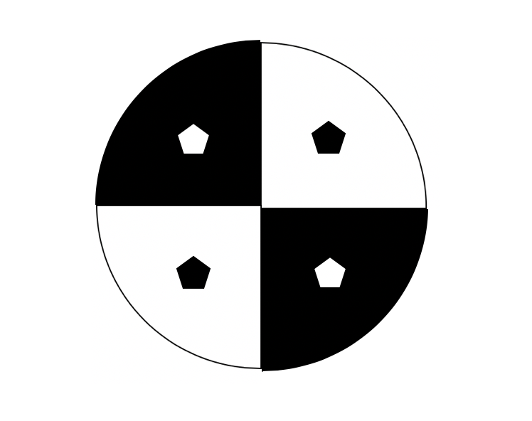
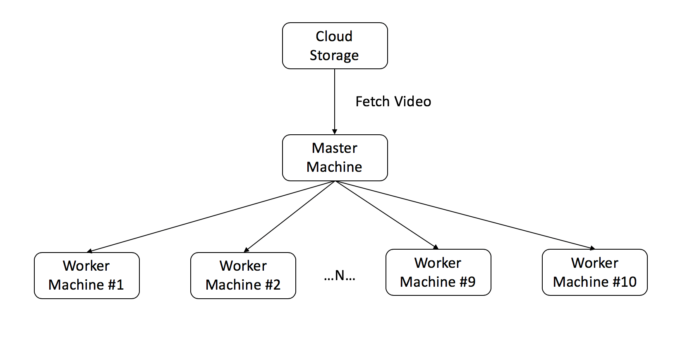

# Secchi Disk Visibility Recognition

:o: format not followed

:o: use the sample and do not make it beautifu;, the sample will do formating correct

:o: integrate refermnces

:o: could we use master worker and not master slave

:o: stream of data is not shown in design

:o: arhitectur how to connect boat to cluster not shown 

Yuli Zhao
Indiana University
Bloomington, Indiana
yulizhao@iu.edu
\

| github: [:cloud:](https://github.com/cloudmesh-community/fa18-423-08/blob/master/project-report/report.md)

## Abstract

Computer vision is designed to imitate human vision. In order to
imitate human vision, enabling computer to see is not enough, computer needs to
be able to analyze what it sees. What computer sees is essentially frames of
images which means nothing to it, but computer is able to analyze the images and
extract useful information out following specific instructions from the
programmer. Due to the nature of computer,  it is able to perform analyzes on a
large scale with specific instructions. This paper will discuss how computer
vision is used in determining water turbidity through recognizing the secchi
disk and extracting measurements as useful information, and how computer vision
is applied to a big data set.

## Introductions

Secchi disk is an eight inch circular disk has alternating black
and white color on the surface. It is used to determine the turbidity or the
transparency of the water. The way it works is that secchi disk is lowered into
the water slowly using a tape that has measurements, and the researcher would
record the measurement when the secchi disk is no longer visible. But one single
measurement does not offer many information to be useful, useful information can
only be extracted by researchers when there are many more measurements. But it
would take researcher enormous amount of time to keep in track with each and
every measurement. And computer vision is needed here to replace all that
workload. Instead of having researcher record every measurement, a camera can be
placed by the measurement that has visual on both the tape measurement and the
secchi disk. The process of lowering secchi disk can be repeated in different
locations by an automated boat, and each process will return result in the
format of a video. Then computer will be able to extract the necessary
information from the video and mitigate the workload for the researcher. 

## Data Collection

The data taken needs to be uniformed in the first place to avoid
further data cleaning. For each video taken, the tape measurement needs to be
placed on the right side of the video at a fixed position. In order to increase
the identifiable feature of the secchi disk, four geometric shape of pentagons
should be placed on the secchi disk, one on each sector. Pentagons on the white
sectors are filled with color black, pentagons on the black sectors are filled
with color white.

## Data Flow

One of the purposes of this project is to create a continuous data
flow from the raw video input, to the output of whether if the secchi disk is
visible and the measurements of the tape. First, the automated boat needs to
equip a hard drive disk to store recorded videos. At the end of each week, the
hard drive needs to be picked up and the video storage needs to be uploaded into
a cloud storage then cleared from the hard drive. To maximize efficiency,
multiple machines are needed to implement a master/worker architecture. One
machine will be the master, the rest of the machines are workers. The master
machine retrieves raw video data from the cloud, and assigns the data to one of
the worker machines. Each worker machine is programmed to break down the video
into frames and perform analysis on each frame, then return two lists of results
with secchi disk visibility and the measurements of the tape. When a worker
machine is done with one analysis, it will tell the master machine that it is
available, and the master machine will assign another raw video to the worker
machine. This cycle will repeat to maximize the efficiency of analyzing the big
data.

## Worker Machine

The first step worker machine needs to do is to take apart the
raw video into separate frames. The analysis need to be performed on each
individual frames. Within each frame, the worker machine needs to run two
functions. One function is to correctly identify the visibility of the secchi
disk. The other function is to correctly identify the position of the tape
measurement, and then run an Optical Character Recognition (OCR) on the position
that reads the number of measurement. The worker machine will return a list of
pair data matching each frame. At last, the worker machine will let the master
machine know that it has finished all its work and available to work on the next
one.

| Secchi Disk Visibility | Depth Measurement |
| ---------------------- | ----------------- |
|        True            |        1'5"       |
|        True            |        2'5"       |
|        True            |        3'5"       |
|        False           |        5'10"      |
|        False           |        8'10"      |

## Approach: Use CNN to Determine the Visibility of Secchi Disk

The position of the secchi disk constantly changes in the process
due to the water turbulence. Instead of trying to locate the exact position of
the secchi disk, a convolutional neural network can be used to train a model
that predicts the visibility of the secchi disk in each frame. Using a
convolutional neural network approach requires many labeled data to begin with
in order to get an accurate model. An example of data is a frame of a video, the
label would be either “yes” or “no”, representing the secchi disk is visible or
not in that certain frame. In order to train an accurate convolutional neural
network model, a large number of data needed to be labeled, approximately 10,000
frames or more. To ensure the accuracy of the model, the training data needs to
cover most scenarios.  It would take a researcher enormous amount of time to
label every frame. Instead, the researcher could design a survey where it is
going display a frame and a “yes” or “no” option. The researcher can recruit 100
volunteers to do 100 of these secchi disk identification questions each. Each
answer along with the frame will be stored in a CSV file where a frame is stored
as a one-dimensional array.

## Training of Convolutional Neural Network Model
Before training the model, the
label of the training data needs to be processed with one-hot encoding. To build
a convolutional neural network model, Keras is a researcher friendly tool to
create and test the model, the parameters should be chosen at the researcher’s
discretion. A sample code is provided in the project code section.

## Tape Measurement Optical Character Recognition(OCR)
The fixed position of the
tape on every frame, allows the researcher to crop out the section of the frame,
then run pytesseract OCR on the section. The instruction to install pytesseract
can be found at www.github.com/tesseract-ocr/tesseract.
